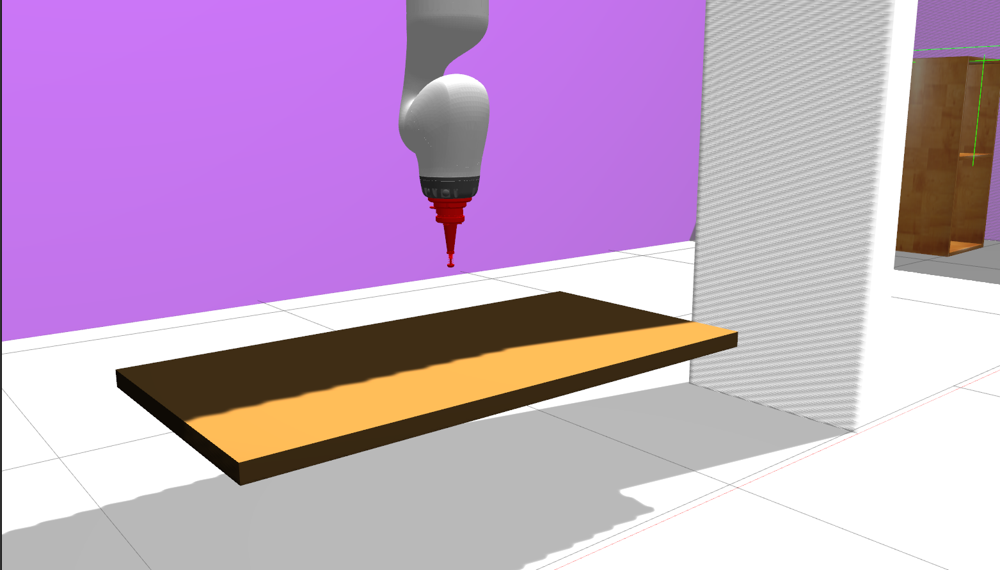
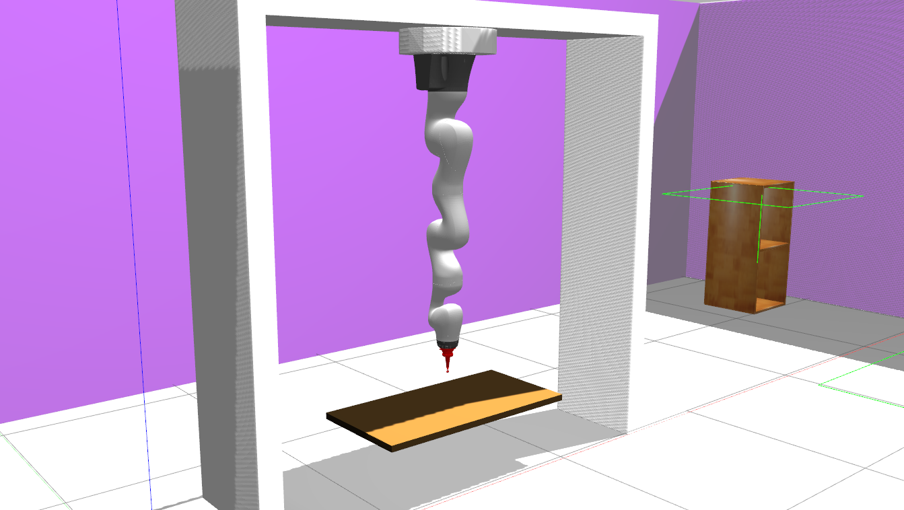

## KUKA LBR Simulation
This package support KUKA iiwa LBR14 simulation (Gazebo) and real robot interface. This code is tested in ROS melodic in Ubuntu 18.04.
ROS Indigo/Kinetic metapackage for the KUKA LBR IIWA R800/R820 (7/14 Kg).

<!-- **Current version : v-1.2.0 for Sunrise 1.11**    
[Using a previous version of Sunrise?](https://github.com/SalvoVirga/iiwa_stack/wiki/FAQ#which-version-of-sunriseossunrise-workbench-is-supported)     -->
<p align="center">


<figcaption align = "center"><b> Fig 1. Simulation Renderings </b></figcaption>
</p>

### Features
- Position, Torque control capability
- Abstract interface for real and simulation topics. Seamless switch between real and simulation environments.
- Point to point quintic polynomial profile path generation
- Trajectory planning with differential dynamic programming

___
### Acknowledgements
This repository takes inspiration from the work of :
- _Centro E. Piaggio_ and their [ROS interface for the KUKA LBR 4+][1]
- _Mohammad Khansari_ and his [IIWA-ROS communication inteface][2]
- _Robert Krug_ and his [IIWA URDF and Gazebo package][7]      

Most of the original files were completely refactored though.


### Gazebo Mode Functionality
- Currently gazebo is supported via position and torque control mode. To run in torque mode, an accurate model of the dynamic model is required to feedforward the torque. The torque can be generated with orocos-kdl. In experimentation.

### Steps to launch  and run control script
- To launch
  - ```roslaunch iiwa_gazebo kuka_force_control.launch```

- To command
  - ```rosrun robot_control position_wrench```
